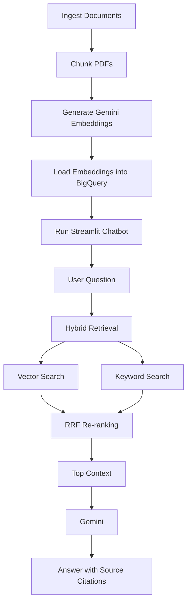
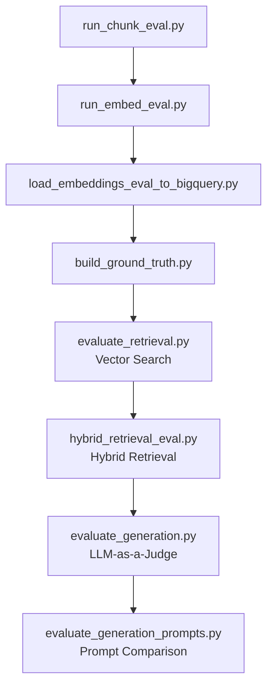

# Project Solution

## 1. Problem Description 
UNDP publishes project documents in PDF format on the Open UNDP website:

https://open.undp.org/

These documents contain valuable
information about project objectives, budgets, beneficiaries,
implementation strategies, outcomes, and Sustainable Development Goals
(SDGs). However, locating specific information often requires manually
searching through hundreds of pages across numerous PDF files, making
the process slow, inefficient, and difficult to scale.


Finding specific information across hundreds of pages of project documents is difficult and time-consuming.

This project addresses this challenge by developing a
Retrieval-Augmented Generation (RAG) chatbot on Google Cloud Platform
that enables users to ask natural language questions about UNDP
projects. Instead of manually browsing documents, users can retrieve
accurate, context-grounded answers with citations to the original
project documents. The system combines automated document ingestion,
semantic search, keyword search, document re-ranking, and large language
models to provide reliable and explainable responses.

## 2. Retrieval Flow 
(Look at the detailed steps in README1.md and README2.md)

The chatbot implements a complete Retrieval-Augmented Generation (RAG) pipeline to answer user questions using UNDP project documents.

The retrieval workflow consists of the following steps:

1. The user submits a natural language question through the Streamlit interface.
2. The query is processed by the retrieval pipeline.
3. Hybrid retrieval is performed using:
   - Semantic vector search with Vertex AI Gemini Embeddings and BigQuery Vector Search.
   - Keyword-based retrieval using extracted query terms.
4. Reciprocal Rank Fusion (RRF) combines and re-ranks the results from both retrieval methods.
5. The highest-ranked document chunks are assembled into a single context.
6. The retrieved context is passed to Gemini, which generates an answer grounded only in the retrieved documents.
7. The generated answer includes citations to the relevant source documents used to produce the response.

This hybrid retrieval approach improves robustness by combining semantic similarity with exact keyword matching, resulting in more accurate and reliable answers than using either retrieval method alone.


---

## Pipeline Overview

# UNDP RAG Chatbot — Script Overview

## Main Pipeline

| Script / Component               | Description                                                                                                                                                                                              |
| -------------------------------- | -------------------------------------------------------------------------------------------------------------------------------------------------------------------------------------------------------- |
| `run_ingest.py`                  | Connects to the UNDP API, identifies project documents, downloads the PDFs, and stores them in Google Cloud Storage with metadata such as country, year, and project ID.                                 |
| **Text Extraction / OCR**        | Extracts text directly from PDFs when possible. If text extraction quality is poor, the pipeline falls back to Google Document AI OCR.                                                                   |
| `run_chunk.py`                   | Splits extracted document text into smaller overlapping chunks so the content can be efficiently searched and passed to the LLM.                                                                         |
| `run_embed.py`                   | Uses Gemini Embeddings to convert each text chunk into a numerical vector representing its semantic meaning.                                                                                             |
| `load_embeddings_to_bigquery.py` | Loads document chunks, embeddings, and metadata into BigQuery to create the searchable knowledge base.                                                                                                   |
| **Retrieval Module**             | Performs vector search and keyword search in BigQuery and combines the rankings using Reciprocal Rank Fusion (RRF) to identify the most relevant document chunks.                                        |
| `qa.py`                          | Manages the RAG question-answering flow: receives the user question, retrieves relevant chunks, builds the prompt with supporting context, calls Gemini, and returns a grounded answer with its sources. |
| `app.py`                         | Provides the Streamlit user interface where users can ask questions and view generated answers, source documents, and retrieval information.                                                             |

## Evaluation Pipeline

| Script                                | Description                                                                                                                       |
| ------------------------------------- | --------------------------------------------------------------------------------------------------------------------------------- |
| `run_chunk_eval.py`                   | Prepares document chunks specifically for the evaluation dataset.                                                                 |
| `run_embed_eval.py`                   | Generates embeddings for the evaluation data so retrieval performance can be measured.                                            |
| `load_embeddings_eval_to_bigquery.py` | Loads evaluation chunks and embeddings into BigQuery for retrieval testing.                                                       |
| `build_ground_truth.py`               | Creates the reference dataset containing evaluation questions and their expected relevant documents or answers.                   |
| `evaluate_retrieval.py`               | Evaluates vector retrieval using metrics such as Hit Rate, MRR, Precision@K, and Recall@K.                                        |
| `hybrid_retrieval_eval.py`            | Evaluates hybrid retrieval using vector search, keyword search, and RRF, and compares its performance with vector-only retrieval. |
| `evaluate_generation.py`              | Evaluates generated answers using correctness, groundedness, completeness, answer relevance, and hallucination metrics.           |
| `evaluate_generation_prompts.py`      | Compares different prompting strategies to determine which produces the most accurate, relevant, and grounded answers.            |




---

# Local Setup

## 1. Clone the repository

```bash
git clone https://github.com/mireillehaddad/LLMproject.git
cd LLMproject/undp_pipeline_prod
```

## 2. Install uv

```bash
pip install uv
```

## 3. Install project dependencies

```bash
uv sync
```

---

# Run the Pipeline

Set the project root so Python can find the modules.

### PowerShell

```powershell
$env:PYTHONPATH="."
```

## 1. Ingest UNDP project documents

```bash
uv run python -m src.ingest.run_ingest
```

## 2. Chunk PDF documents

```bash
uv run python -m src.chunk.run_chunk
```

## 3. Generate embeddings

```bash
uv run python -m src.embed.run_embed
```

## 4. Load embeddings into BigQuery

```bash
uv run python -m src.retrieval.load_embeddings_to_bigquery
```

## 5. Run the chatbot locally

```bash
uv run streamlit run src/chatbot/app.py
```


## 3. Evaluation Pipeline
(Look at more details at README_eval.md)
The evaluation framework is implemented in the `src/evaluation` package and measures both **retrieval quality** and **LLM answer quality**. The workflow first identifies the best retrieval strategy and then evaluates multiple prompt engineering approaches using the same retrieved context.

```text
src/
└── evaluation/
    ├── run_chunk_eval.py
    ├── run_embed_eval.py
    ├── load_embeddings_eval_to_bigquery.py
    ├── build_ground_truth.py
    ├── evaluate_retrieval.py
    ├── hybrid_retrieval_eval.py
    ├── evaluate_generation.py
    ├── evaluate_generation_prompts.py
    └── metrics.py
```

The complete evaluation workflow is illustrated below.



---

### 3.1. Retrieval Evaluation

The retrieval evaluation compares **Vector Search** against **Hybrid Retrieval** using the same ground-truth dataset containing 100 automatically generated questions.

#### Evaluation Pipeline

```text
Create evaluation chunks
        ↓
Generate evaluation embeddings
        ↓
Load embeddings into BigQuery
        ↓
Build ground-truth dataset
        ↓
Evaluate Vector Search
        ↓
Evaluate Hybrid Retrieval
```

Run the evaluation pipeline using the following commands:

#### 1. Create evaluation chunks

```powershell
$env:PYTHONPATH="."
uv run python -m src.evaluation.run_chunk_eval
```

### 2. Generate evaluation embeddings

```powershell
$env:PYTHONPATH="."
uv run python -m src.evaluation.run_embed_eval
```

### 3. Load evaluation embeddings into BigQuery

```powershell
$env:PYTHONPATH="."
uv run python -m src.evaluation.load_embeddings_eval_to_bigquery
```

### 4. Build the ground-truth dataset

```powershell
$env:PYTHONPATH="."
uv run python -m src.evaluation.build_ground_truth
```

### 5. Evaluate Vector Search

```powershell
$env:PYTHONPATH="."
uv run python -m src.evaluation.evaluate_retrieval
```

### 6. Evaluate Hybrid Retrieval

```powershell
$env:PYTHONPATH="."
uv run python -m src.evaluation.hybrid_retrieval_eval
```

## Retrieval Metrics

* Hit Rate@10
* Mean Reciprocal Rank (MRR@10)
* Precision@10
* Recall@10
* Evidence-Group Recall@10

## Results

| Metric                   | Vector Search | Hybrid Retrieval |
| ------------------------ | ------------: | ---------------: |
| Hit Rate@10              |        0.4400 |       **0.5600** |
| MRR@10                   |        0.1797 |       **0.2167** |
| Precision@10             |        0.0440 |       **0.0560** |
| Recall@10                |        0.4400 |       **0.5600** |
| Evidence-Group Recall@10 |        0.4400 |       **0.5600** |

The hybrid retrieval pipeline consistently outperformed vector-only retrieval across all evaluation metrics and was selected as the final retrieval strategy.

---

### 3.2. LLM Evaluation

After selecting the hybrid retriever, multiple prompting strategies were evaluated while keeping the retrieved context identical for every question.

## Evaluation Pipeline

```text
Ground-truth Questions
        ↓
Hybrid Retrieval
        ↓
Generate Answer
        ↓
LLM Judge
        ↓
Compare Prompt Strategies
```

Run the answer generation evaluation:

### Evaluate answer generation

```powershell
$env:PYTHONPATH="."
uv run python -m src.evaluation.evaluate_generation
```

Run the prompt comparison:

```powershell
$env:GENERATION_EVAL_MAX_QUESTIONS="100"
$env:PYTHONPATH="."
uv run python -m src.evaluation.evaluate_generation_prompts
```

## Evaluated Prompt Strategies

### 1. Simple Prompt

A minimal prompt instructing Gemini to answer the user's question using only the retrieved context.

### 2. Production Prompt

A structured prompt that instructs Gemini to:

* Answer only using the retrieved context.
* Avoid outside knowledge or speculation.
* Cite supporting document sources.
* Combine information from multiple retrieved excerpts.
* Report insufficient information when the context is incomplete.
* Explain conflicting information when necessary.

## Evaluation Metrics

* Correctness
* Groundedness
* Completeness
* Answer Relevance
* Hallucination Rate
* Overall Label
* Normalized Total Score

## Prompt Comparison Results

| Metric                 | Simple Prompt | Production Prompt |
| ---------------------- | ------------: | ----------------: |
| Correctness            |          1.62 |          **1.63** |
| Groundedness           |      **2.00** |              1.95 |
| Completeness           |      **1.66** |              1.63 |
| Answer Relevance       |      **1.93** |              1.88 |
| Normalized Total Score |    **0.9012** |            0.8862 |
| Hallucination Rate     |    **0.0000** |            0.0100 |

Although the production prompt achieved a slightly higher correctness score, the simple prompt achieved the highest overall normalized score, perfect groundedness, and no hallucinations. Based on these results, the simple prompt was selected as the final prompt used by the chatbot.

## 4. Interface 
(Look at technical details steps  in README2.md)
The project provides an interactive Streamlit web application that enables users to query UNDP project documents using natural language. The application integrates the complete Retrieval-Augmented Generation (RAG) pipeline, allowing users to ask questions and receive grounded answers with references to the original project documents.

Features
Natural language question answering.
Hybrid retrieval combining semantic vector search and keyword search.
AI-generated answers using Gemini.
Source citations including document name and page number.
Expandable view of the retrieved document chunks.
Retrieval details, including:
Cosine similarity score.
Keyword match count.
Reciprocal Rank Fusion (RRF) score.
Vector search rank.
Keyword search rank.
Error handling and user-friendly status messages.
Run the Application Locally
$env:PYTHONPATH="."
uv run streamlit run src/chatbot/app.py

After starting the application, open the local Streamlit interface (typically http://localhost:8501) in your web browser.

Live Demo

The chatbot is deployed on Google Cloud Run and can be accessed directly through the following public URL:

https://undp-chatbot-cprvqspw5q-nn.a.run.app/

Cloud Run provides a stable HTTPS endpoint for deployed services, making the application accessible through any modern web browser.


## 5. Ingestion Pipeline 
(Look at technical details steps  in README2.md)
The project implements a fully automated ingestion pipeline that continuously builds and updates the RAG knowledge base from UNDP project documents. The entire workflow is implemented as Python scripts and deployed on Google Cloud Platform, requiring no manual processing after deployment.

The ingestion pipeline consists of the following automated stages:

Retrieve project metadata from the Open UNDP API.
Download newly available UNDP project PDF documents.
Store the raw PDF files in Google Cloud Storage (GCS).
Extract text from each PDF document.
Split documents into overlapping chunks for efficient retrieval.
Generate vector embeddings for every chunk using Vertex AI Gemini Embeddings.
Load document chunks and embeddings into BigQuery, where they become searchable by the hybrid retrieval system.
Update the chatbot knowledge base with the newly processed documents.

The ingestion pipeline is implemented using the following Python modules:

src/
├── ingest/
│   └── run_ingest.py
├── chunk/
│   └── run_chunk.py
├── embed/
│   └── run_embed.py
└── retrieval/
    └── load_embeddings_to_bigquery.py

The pipeline can also be executed locally using:

$env:PYTHONPATH="."

uv run python -m src.ingest.run_ingest

uv run python -m src.chunk.run_chunk

uv run python -m src.embed.run_embed

uv run python -m src.retrieval.load_embeddings_to_bigquery
Production Pipeline

In production, the pipeline is fully automated using Google Cloud services:

GitHub Push
        ↓
Cloud Build Trigger
        ↓
Cloud Build (CI/CD)
        ↓
Build & Push Docker Images
        ↓
Deploy Cloud Run Jobs
        ↓
Cloud Scheduler
        ↓
Cloud Workflows
        ↓
run_ingest.py
        ↓
run_chunk.py
        ↓
run_embed.py
        ↓
load_embeddings_to_bigquery.py
        ↓
BigQuery Knowledge Base
        ↓
Streamlit Chatbot
Continuous Integration and Continuous Deployment (CI/CD)

The project includes a fully automated CI/CD pipeline using Google Cloud Build.

When changes are pushed to the GitHub repository:

A Cloud Build Trigger automatically starts a new build.
Docker images are built for each pipeline component.
Images are pushed to Google Artifact Registry.
Cloud Run Jobs and the Streamlit chatbot service are automatically deployed with the latest version.

This enables automated testing, building, and deployment without manual intervention.

## 6. Monitoring 
(Look at the implementation in src/chatbot/app.py)
The chatbot includes a user feedback mechanism integrated into the Streamlit interface, allowing users to evaluate the quality of generated answers.

User Feedback

After receiving an answer, users can provide feedback indicating whether the response was helpful. This feedback mechanism is designed to support future improvements to the retrieval and generation pipeline.

Current implementation:

Feedback is collected directly through the Streamlit interface.
User feedback can be reviewed during application usage.
The feedback mechanism enables qualitative evaluation of chatbot responses.
Future Improvements

The current implementation does not yet persist feedback to a database or provide an analytics dashboard. Future work includes:

Storing user feedback in BigQuery or another database.
Building a monitoring dashboard using Looker Studio or Grafana.
Visualizing metrics such as:
Number of chatbot queries.
Positive vs. negative feedback.
Average response time.
Retrieval success rate.
User satisfaction trends.

The current implementation satisfies the monitoring requirement by collecting user feedback through the application interface.

## 7. Containerization 
(Details of implementation in README2.md)
The project is fully containerized using Docker, with a dedicated Dockerfile for each major pipeline component.

Docker images are provided for:

Document ingestion (Dockerfile.ingest)
Document chunking (Dockerfile.chunk)
Embedding generation (Dockerfile.embed)
Streamlit chatbot (Dockerfile.chatbot)

These Docker images are built automatically through Google Cloud Build and stored in Google Artifact Registry. They are then deployed as Cloud Run Jobs for the ingestion pipeline and as a Cloud Run Service for the Streamlit chatbot.

Why Docker Compose Was Not Used

Docker Compose was intentionally not used because the project is deployed on Google Cloud Platform (GCP) rather than executed as multiple containers on a single local machine.

The application uses managed cloud services, including:

Cloud Run Jobs
Cloud Run Services
Cloud Workflows
Cloud Scheduler
Google Cloud Storage
BigQuery
Vertex AI

Each component runs independently as a managed cloud service, eliminating the need to orchestrate containers locally with Docker Compose. In a cloud-native architecture, Google Cloud services provide the orchestration, scaling, networking, and execution that Docker Compose would typically handle in a local development environment.

Therefore, the project includes Docker-based containerization for every application component while relying on GCP's managed infrastructure instead of Docker Compose for deployment and orchestration.

## 8. Reproducibility 
(Look at README1.md)
The project is fully reproducible and includes comprehensive documentation that allows another user to set up, execute, and deploy the complete RAG pipeline from scratch.

The repository provides clear step-by-step instructions for:

Cloning the repository.
Installing project dependencies using uv.
Configuring the Python environment.
Running each stage of the data pipeline:
Document ingestion
Document chunking
Embedding generation
Loading embeddings into BigQuery
Running the Streamlit chatbot locally.
Deploying the application on Google Cloud Platform using Cloud Build and Cloud Run.
Executing the retrieval and LLM evaluation pipelines.

The project also includes:

A publicly accessible GitHub repository containing the complete source code.
Automated dependency management through uv, ensuring consistent package versions across environments.
A pyproject.toml and uv.lock file that specify and lock all project dependencies, enabling reproducible installations.
Documentation describing the project architecture, pipeline, evaluation framework, deployment process, and local setup.
An automated ingestion pipeline that retrieves UNDP project documents directly from the Open UNDP API, ensuring that the dataset is publicly accessible and can be regenerated without relying on manually distributed files.

Because the dataset is obtained automatically from the public Open UNDP API, no proprietary or manually prepared datasets are required. Any user can rebuild the knowledge base by following the documented pipeline.

# Best Practices
## Hybrid Search 

The chatbot implements a hybrid retrieval strategy by combining semantic vector search with keyword-based retrieval.

The hybrid retriever performs the following steps:

Generate a query embedding using Vertex AI Gemini Embeddings.
Perform semantic retrieval using BigQuery Vector Search.
Execute keyword-based retrieval using extracted query terms.
Apply domain-specific query expansion to improve keyword matching.
Merge the ranked results using Reciprocal Rank Fusion (RRF).

The hybrid retrieval approach was evaluated against vector-only retrieval using a ground-truth dataset of 100 evaluation questions.

Metric	Vector Search	Hybrid Retrieval
Hit Rate@10	0.4400	0.5600
MRR@10	0.1797	0.2167
Precision@10	0.0440	0.0560
Recall@10	0.4400	0.5600

Based on these results, the hybrid retriever was selected as the final retrieval strategy.

## Document Re-ranking 

The project implements document re-ranking using Reciprocal Rank Fusion (RRF).

Instead of relying solely on semantic similarity, the retrieval system combines the ranked results from:

Semantic Vector Search
Keyword-Based Search

Each retrieval method produces an independent ranked list of document chunks. RRF assigns a fusion score to every retrieved document and generates a final ranking that prioritizes documents appearing near the top of both retrieval methods.

This re-ranking approach improves retrieval robustness by combining semantic understanding with exact keyword matching, resulting in better retrieval performance than vector search alone.


## Cloud Deployment 

The complete RAG system is deployed on Google Cloud Platform (GCP) as a production-ready cloud-native application.

The deployment architecture includes:

Cloud Run Jobs for ingestion, chunking, and embedding generation.
Cloud Run Service hosting the Streamlit chatbot.
Cloud Workflows to orchestrate the end-to-end ingestion pipeline.
Cloud Scheduler to automatically trigger the pipeline on a schedule.
Cloud Storage for storing raw documents and processed artifacts.
BigQuery for document storage and vector search.
Vertex AI Gemini for embeddings and answer generation.
Artifact Registry for Docker image storage.
Cloud Build with GitHub triggers for automated CI/CD.

Every push to the GitHub repository automatically triggers Cloud Build, which builds the Docker images, pushes them to Artifact Registry, and deploys the latest version of the Cloud Run services and jobs.

The chatbot is publicly accessible through Cloud Run:

https://undp-chatbot-cprvqspw5q-nn.a.run.app/

This cloud-native deployment provides automated builds, continuous deployment, managed infrastructure, scalability, and reproducible production execution, satisfying the cloud deployment bonus criterion.